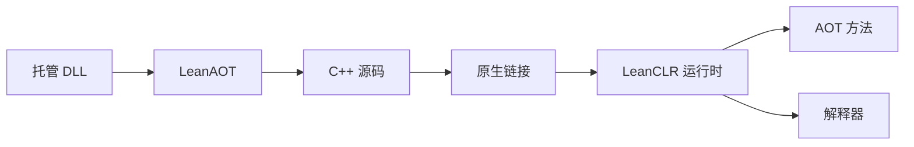

# AOT 概述

## 什么是 LeanAOT

**LeanAOT** 是 LeanCLR 的 Ahead-of-Time 编译器，将托管程序集（`.dll`）翻译为 **C++ 源码**，概念上类似 IL2CPP。

| 输入 | 输出 |
|------|------|
| 一个或多个托管程序集 | `*.method_body_partN.cpp`、模块注册代码、`modules_registration.cpp` 等 |

生成代码与 LeanCLR 运行时链接后，已 AOT 的方法以原生速度执行；未 AOT 的方法由 **IR 解释器** 执行。

## 典型使用场景

- **原生 / WASM 嵌入**：将热点 C# 编译进最终二进制
- **Unity WebGL / 小游戏**：由 leanclr-unity 在构建管线中自动调用
- **包体优化**：配合 [`aot.xml`](./rule-file) 与 [`pgo-aot.xml`](./pgo) 控制 AOT 范围

## 社区版与商业版

LeanAOT 提供 **社区版**与**商业版**，在可 AOT 的语言特性范围与优化深度上不同。详见 [社区版与商业版](./community-vs-commercial)。

## 与 link.xml 的关系

`aot.xml` / `pgo-aot.xml` 仅由 **LeanAOT** 消费，与 Unity **`link.xml`**（托管裁剪）**无关**。两者可同时使用，互不影响。

## 文档导航

| 主题 | 文档 |
|------|------|
| 工具构建与基本用法 | [LeanAOT 工具](./leanaot-tool) |
| IL → C++ → 链接 → 注册 | [AOT 工作流](./workflow) |
| 手工规则 `aot.xml` | [AOT 规则文件](./rule-file) |
| 热点优化 `pgo-aot.xml` | [Profile Guided AOT](./pgo) |
| 命令行与环境变量 | [CLI 参考](./cli-reference) |

## 执行模型回顾

更多架构背景见 [架构概览](../intro/architecture)。
