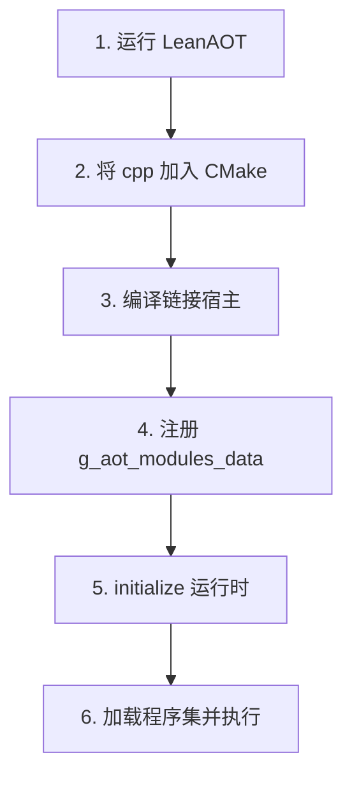

# AOT 工作流

本文描述从托管 DLL 到运行时可执行 AOT 代码的完整流程。

## 端到端流程



## 步骤 1：运行 LeanAOT

```bat
dotnet out\dotnet\LeanAOT\Release\net8.0\LeanAOT.dll ^
  -d libraries\dotnetframework4.x ^
  -d myapp\bin\Release ^
  -a mscorlib ^
  -a MyApp ^
  -o myproject\generated\cpp
```

可选附加 `--leanaot-aot-rule-file` 控制哪些方法生成 AOT 代码。

**何时重新运行：** 托管 DLL 变更、AOT 规则变更、LeanAOT 版本升级。

## 步骤 2：纳入 CMake 构建

将生成目录中的 `*.cpp` 加入宿主目标：

```cmake
file(GLOB LEANCLR_AOT_SOURCES "generated/cpp/*.cpp")
add_executable(my_app main.cpp ${LEANCLR_AOT_SOURCES})
target_link_libraries(my_app PRIVATE leanclr)
```

建议将生成文件放在独立目录（如 `generated/cpp/`），便于 `.gitignore` 与 CI 缓存。

确保 **`modules_registration.cpp`** 在同一目标中编译——它导出全局 `g_aot_modules_data`。

## 步骤 3：编译链接

与构建 LeanCLR 运行时相同，宿主工程需 **C++11** 并链接 `leanclr` 静态库。

## 步骤 4：运行时注册 AOT 模块

在 `vm::Runtime::initialize()` **之前**：

```cpp
#include "vm/settings.h"

extern leanclr::metadata::RtAotModulesData g_aot_modules_data;

vm::Settings::set_file_loader(assembly_file_loader);
vm::Settings::set_aot_modules_data(&g_aot_modules_data);

auto result = vm::Runtime::initialize();
```

`g_aot_modules_data` 由 LeanAOT 生成的 `modules_registration.cpp` 定义。

## 步骤 5：加载程序集并执行

初始化成功后，照常 `Assembly::load_by_name` 与方法调用。已 AOT 的方法自动走原生路径。

最小启动序列：

```cpp
vm::Settings::set_file_loader(assembly_file_loader);
vm::Settings::set_aot_modules_data(&g_aot_modules_data);
vm::Runtime::initialize();
// load assemblies, invoke entry
```

## 完整示例

仓库内参考：

| 路径 | 说明 |
|------|------|
| `src/samples/simple-aot/` | CMake + `g_aot_modules_data` 最小示例 |
| `src/tests/aot-tester/` | AOT 正确性测试 runner |

## Unity 构建

Unity 用户无需手写上述步骤——[leanclr-unity](../ecosystem/unity/build) 在发布时自动完成 LeanAOT 调用、C++ 编译与数据文件生成。

## 相关文档

- [LeanAOT 工具](./leanaot-tool)
- [嵌入 LeanCLR](../integration/embed-leanclr)
- [AOT 规则文件](./rule-file)
- [Profile Guided AOT](./pgo)
