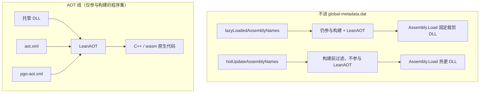

# LeanAOT 与包体优化概念

Unity 集成里与「AOT」「包体」相关的选项较多，名称也相似，容易混用。**请先读完本页**，再配置 [项目设置](./settings)。

:::warning 最容易搞混的几点
**延迟加载**、**热更新** 与 **AOT** 是不同维度的机制，请勿混为一谈。

| 机制 | 主要影响 | 减小 / 控制什么 |
|------|----------|-----------------|
| **AOT**（LeanAOT、`aot.xml`、`pgo-aot.xml`） | 哪些 IL 被译为 C++ 并进包 | **AOT 原生代码**体积 |
| **延迟加载**（`lazyLoadedAssemblyNames`） | 哪些程序集写入 `global-metadata.dat`；**仍参与构建与 LeanAOT** | **metadata** 体积；运行时加载**固定版本**裁剪 DLL |
| **热更新**（`hotUpdateAssemblyNames`） | 构建前从管线**过滤**，不参与 LeanAOT | **metadata** 不占位内嵌 DLL；运行时加载**可变更** DLL |

**延迟加载 ≠ 热更新**：lazy 的程序集**可以**被 AOT；hot update 程序集**不可能**有 AOT。二者**不能**配置同一程序集。对比见 [延迟加载与热更新](#lazy-vs-hot-update)。
:::

## 一图分清两条优化线

小游戏、WebGL 等平台往往**同时**受限于首包 wasm 体积与元数据体积，因此两条线都可能需要优化，但请分别理解、分别配置。

## 概念对照表

| 概念 | 解决什么问题 | 配置入口 | 详细文档 |
|------|--------------|----------|----------|
| **LeanAOT** | 将 IL 译为 C++ 并编译为原生代码，使 C# 热点达到接近 native 的性能 | 构建时自动调用（无需单独开关） | [AOT 概述](../../aot/overview) |
| **AOT 规则文件**（`aot.xml`） | 全量 AOT 时**原生代码过大**；只对部分托管代码做 AOT，减小 AOT 体积 | Settings → `ruleFiles` | [AOT 规则文件](../../aot/rule-file) |
| **PGO**（`pgo-aot.xml`） | 在 `aot.xml` 粗粒度策略基础上，用运行时 profile **自动**挑出热点方法做 AOT | Settings → `enablePgoProfile`、`pgoRuleFiles` | [Unity 中的 PGO](./pgo) |
| **延迟加载程序集** | `global-metadata.dat` 过大；同版本按需加载 | `lazyLoadedAssemblyNames` | [延迟加载](./lazy-load) |
| **热更新程序集** | 逻辑热更；构建前排除、无 AOT | `hotUpdateAssemblyNames` | [代码热更新](./hot-update) |

## LeanAOT

**LeanAOT** 是 LeanCLR 的 AOT 编译器：把托管程序集里的 IL **翻译为 C++**，再与运行时一起编译、链接为原生代码（WebGL 上即 wasm 中的对应部分）。

- **作用**：让被选中的 C# 方法以**原生速度**执行；未 AOT 的方法仍由解释器执行。
- **与包体的关系**：AOT 越多，生成的 C++ / 原生代码**越大**；LeanAOT 本身是能力，**不自动**帮你减小包体。
- **在 Unity 中**：发布 Player 时 leanclr-unity 会**自动**调用 LeanAOT，一般无需单独开启。

## AOT 规则文件（`aot.xml`） {#aot-rule-file}

**目标**：解决「全部 AOT」时**包体过大**的问题。在 WebAssembly、小游戏等平台常有严格**首包体积**限制，需要只对**一部分**托管代码做 AOT，从而减小 **AOT 原生代码**体积。

- **手段**：在 `aot.xml` 里按程序集 / 类型 / 方法配置包含或排除（例如对大程序集设 `aot="0"`，默认尽量少 AOT）。
- **优点**：策略灵活，可精确到方法级。
- **缺点**：需要**手动编写与维护**规则，工作量大，容易遗漏热点或误排除。
- **配置**：LeanCLR Settings → Lean AOT → **`ruleFiles`**。
- **注意**：只影响 LeanAOT **翻译哪些 IL**，**不**影响 `global-metadata.dat` 里有哪些程序集。

## PGO（Profile Guided AOT） {#pgo}

**目标**：在 `aot.xml` 的粗粒度策略之上，根据**真实运行**数据决定「哪些函数值得 AOT」，减少手工猜热点的工作，同时控制 AOT 代码体积。

典型流程：

1. **采集 profile**：开启 `enablePgoProfile`，发布 profiling 构建，在游戏中跑代表性流程，导出 profile 数据（JSON，如 `global-*.json`）。
2. **生成规则**：用 **pgo2aot** 读取该 JSON，计算应 AOT 的方法，输出 **`pgo-aot.xml`**。
3. **正式构建**：关闭 `enablePgoProfile`，在 **`pgoRuleFiles`** 中配置 `pgo-aot.xml`，再发布正式包；LeanAOT 读取该文件**追加** AOT 范围。

- **与 `aot.xml` 的关系**：`aot.xml` 定「大方向」（例如整程序集默认不 AOT）；`pgo-aot.xml` 在允许范围内**追加**热点方法。二者都作用于 **AOT 代码大小**，与延迟加载无关。
- **详细步骤**：[Unity 中的 PGO](./pgo)、[Profile Guided AOT](../../aot/pgo)。

## 延迟加载程序集（lazy loaded assembly） {#lazy-load}

**目标**：减小 **`global-metadata.dat`**，并对启动阶段不需要的模块做**同版本**按需加载。

- **配置**：Lean AOT → **`lazyLoadedAssemblyNames`**
- **构建**：程序集**仍进入** Unity / LeanAOT 管线；可按 `aot.xml` 生成 AOT 代码
- **运行时**：`Assembly.Load` 加载的字节必须与 `Library/LeanCLR/ManagedStripped/{buildTarget}/` 中**本次构建的裁剪 DLL 完全一致**，**不允许改动**
- **与 AOT**：lazy load 只影响 metadata；**不**自动禁用 AOT

## 热更新程序集（hot update assembly） {#hot-update}

**目标**：程序集**不参与** Player 构建，运行时加载**新版本** DLL 做逻辑热更。

- **配置**：**Hot Update** → **`hotUpdateAssemblyNames`**（`HotUpdateSettings`）
- **构建**：`FilterHotUpdateAssembly` 在构建前过滤，**完全不参与** LeanAOT，故**不可能**有 AOT
- **运行时**：自行下载 / 分包 + `Assembly.Load`；DLL 可与首包版本不同（须兼容同一 Unity / 裁剪基线）

## 延迟加载与热更新 {#lazy-vs-hot-update}

| | 延迟加载 | 热更新 |
|--|----------|--------|
| 参与构建 | ✅ 是 | ❌ 构建前过滤 |
| 可有 AOT | ✅ 可以 | ❌ 不可能 |
| 运行时 DLL | 与构建裁剪结果**字节一致** | 可为**新版本** |
| 不进 `global-metadata.dat` | ✅ | ✅ |
| `Assembly.Load` | ✅ | ✅ |
| AssetBundle 脚本还原 | ✅ | ✅ |
| 同一程序集互斥配置 | — | 不可同时出现在两个列表 |

详见 [延迟加载](./lazy-load)、[代码热更新](./hot-update)。

## 常见误解

| 误解 | 实际情况 |
|------|----------|
| 热更新程序集应配在 `lazyLoadedAssemblyNames` | ❌ 应使用 **`hotUpdateAssemblyNames`**；二者互斥 |
| 配置了 lazy load，程序集就不会 AOT | ❌ lazy load 只影响 metadata；默认仍可 AOT |
| 延迟加载可以加载热更后的新 DLL | ❌ lazy load 必须加载**构建期固定**裁剪 DLL |
| 热更程序集要在 `aot.xml` 里 `aot="0"` | ❌ 热更程序集未参与构建，**无需**也**无法**对其 AOT |
| `aot.xml` 里 `aot="0"` 能减小 metadata | ❌ metadata 靠 lazy load / hot update 列表控制 |
| PGO 可以替代 lazy load | ❌ PGO 只影响 AOT 方法选择 |
| 把 DLL 放到 CDN 就等于 lazy load 或热更 | ❌ 须在 Settings 中声明对应列表，并 `Assembly.Load` |

## 推荐阅读顺序

1. 本页（概念辨析）
2. [项目设置](./settings) — 各开关含义
3. 按需：[AOT 规则文件](../../aot/rule-file)、[Unity 中的 PGO](./pgo)、[延迟加载](./lazy-load)、[代码热更新](./hot-update)
