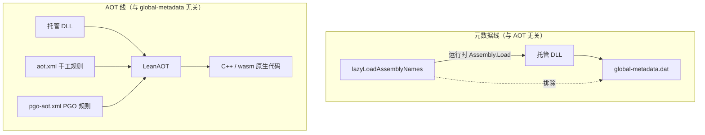

# LeanAOT 与包体优化概念

Unity 集成里与「AOT」「包体」相关的选项较多，名称也相似，容易混用。**请先读完本页**，再配置 [项目设置](./settings)。

:::warning 最容易搞混的一点
**延迟加载（lazy loaded assembly）与 AOT 是完全独立、互不相干的两种机制。**

| 机制 | 主要影响 | 减小的是什么 |
|------|----------|--------------|
| **AOT 相关**（LeanAOT、`aot.xml`、`pgo-aot.xml`） | 哪些托管代码被翻译成 C++ 并编译进原生产物 | **AOT 原生代码**体积 |
| **延迟加载**（`lazyLoadAssemblyNames`） | 哪些程序集写入 `global-metadata.dat` | **`global-metadata.dat`（元数据）**体积 |

二者可以**同时**使用，也可以**只配其一**；配置一项**不会**自动影响另一项。
:::

## 一图分清两条优化线

小游戏、WebGL 等平台往往**同时**受限于首包 wasm 体积与元数据体积，因此两条线都可能需要优化，但请分别理解、分别配置。

## 概念对照表

| 概念 | 解决什么问题 | 配置入口 | 详细文档 |
|------|--------------|----------|----------|
| **LeanAOT** | 将 IL 译为 C++ 并编译为原生代码，使 C# 热点达到接近 native 的性能 | 构建时自动调用（无需单独开关） | [AOT 概述](../../aot/overview) |
| **AOT 规则文件**（`aot.xml`） | 全量 AOT 时**原生代码过大**；只对部分托管代码做 AOT，减小 AOT 体积 | Settings → `ruleFiles` | [AOT 规则文件](../../aot/rule-file) |
| **PGO**（`pgo-aot.xml`） | 在 `aot.xml` 粗粒度策略基础上，用运行时 profile **自动**挑出热点方法做 AOT | Settings → `enablePgoProfile`、`pgoRuleFiles` | [Unity 中的 PGO](./pgo) |
| **延迟加载程序集** | 所有 DLL 默认进 `global-metadata.dat` 导致**元数据过大**；启动用不到的程序集可不进 metadata | Settings → `lazyLoadAssemblyNames` | [延迟加载](./lazy-load) |

## LeanAOT

**LeanAOT** 是 LeanCLR 的 AOT 编译器：把托管程序集里的 IL **翻译为 C++**，再与运行时一起编译、链接为原生代码（WebGL 上即 wasm 中的对应部分）。

- **作用**：让被选中的 C# 方法以**原生速度**执行；未 AOT 的方法仍由解释器执行。
- **与包体的关系**：AOT 越多，生成的 C++ / 原生代码**越大**；LeanAOT 本身是能力，**不自动**帮你减小包体。
- **在 Unity 中**：发布 Player 时 leanclr-unity 会**自动**调用 LeanAOT，一般无需单独开启。

## AOT 规则文件（`aot.xml`） {#aot-rule-file}

**目标**：解决「全部 AOT」时**包体过大**的问题。在 WebAssembly、小游戏等平台常有严格**首包体积**限制，需要只对**一部分**托管代码做 AOT，从而减小 **AOT 原生代码**体积。

- **手段**：在 `aot.xml` 里按程序集 / 类型 / 方法配置包含或排除（例如对大程序集设 `aot="0"`，默认尽量少 AOT）。
- **优点**：策略灵活，可精确到方法级。
- **缺点**：需要**手动编写与维护**规则，工作量大，容易遗漏热点或误排除。
- **配置**：LeanCLR Settings → Lean AOT → **`ruleFiles`**。
- **注意**：只影响 LeanAOT **翻译哪些 IL**，**不**影响 `global-metadata.dat` 里有哪些程序集。

## PGO（Profile Guided AOT） {#pgo}

**目标**：在 `aot.xml` 的粗粒度策略之上，根据**真实运行**数据决定「哪些函数值得 AOT」，减少手工猜热点的工作，同时控制 AOT 代码体积。

典型流程：

1. **采集 profile**：开启 `enablePgoProfile`，发布 profiling 构建，在游戏中跑代表性流程，导出 profile 数据（JSON，如 `global-*.json`）。
2. **生成规则**：用 **pgo2aot** 读取该 JSON，计算应 AOT 的方法，输出 **`pgo-aot.xml`**。
3. **正式构建**：关闭 `enablePgoProfile`，在 **`pgoRuleFiles`** 中配置 `pgo-aot.xml`，再发布正式包；LeanAOT 读取该文件**追加** AOT 范围。

- **与 `aot.xml` 的关系**：`aot.xml` 定「大方向」（例如整程序集默认不 AOT）；`pgo-aot.xml` 在允许范围内**追加**热点方法。二者都作用于 **AOT 代码大小**，与延迟加载无关。
- **详细步骤**：[Unity 中的 PGO](./pgo)、[Profile Guided AOT](../../aot/pgo)。

## 延迟加载程序集（lazy loaded assembly） {#lazy-load}

**目标**：解决 **`global-metadata.dat` 过大**的问题。构建时，所有托管 DLL 默认都会写入 `global-metadata.dat`，导致元数据体积膨胀；对**启动阶段用不到**的程序集，可配置为延迟加载，使其**不进入** `global-metadata.dat`，从而减小首包中的**元数据**体积。

- **配置**：LeanCLR Settings → Lean AOT → **`lazyLoadAssemblyNames`**（程序集短名，无 `.dll`）。
- **运行时**：在使用到该程序集的代码之前，开发者须自行 **`Assembly.Load`**（或等价方式）加载对应 DLL。
- **DLL 从哪来**：裁剪后的程序集字节须与构建期一致，通常从 `Library/LeanCLR/ManagedStripped/{buildTarget}/` 获取；也可放到小游戏**分包**、通过 **HTTP 下载**等，由业务自行分发。
- **与 AOT 的关系**：延迟加载程序集**仍会参与 LeanAOT 编译**（除非你在 `aot.xml` 里对该程序集另有排除）。「不进 metadata」≠「不 AOT」；二者独立配置。详见 [延迟加载](./lazy-load)。

## 常见误解

| 误解 | 实际情况 |
|------|----------|
| 配置了 lazy load，程序集就不会生成 AOT 代码 | ❌ 默认仍会 AOT；lazy load 只影响是否写入 `global-metadata.dat` |
| `aot.xml` 里 `aot="0"` 能减小 metadata | ❌ `aot.xml` 只控制 AOT 范围，不控制 metadata 里有哪些程序集 |
| PGO 可以替代 lazy load | ❌ PGO 只优化 **哪些方法 AOT**；metadata 体积要靠 lazy load（或其它加载策略） |
| 把 DLL 放到 CDN 就等于 lazy load | ❌ 还须先在 Settings 里声明 `lazyLoadAssemblyNames`，且运行时主动 `Assembly.Load` |

## 推荐阅读顺序

1. 本页（概念辨析）
2. [项目设置](./settings) — 各开关含义
3. 按需：[AOT 规则文件](../../aot/rule-file)、[Unity 中的 PGO](./pgo)、[延迟加载](./lazy-load)
