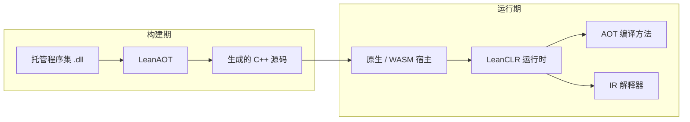

# 架构概览

## 执行模型总览

1. **构建期**：可选地使用 [LeanAOT](../aot/overview) 将托管程序集翻译为 C++，与宿主工程一并编译链接。
2. **运行期**：LeanCLR 加载元数据与程序集；对已 AOT 的方法走原生代码，其余走 IR 解释器。
3. **无 JIT**：所有原生代码均在构建期生成，适合 WASM、小游戏等禁止 JIT 的平台。

## 运行时核心模块

| 模块 | 职责 |
|------|------|
| **metadata** | PE/COFF 与 CLI 元数据解析 |
| **vm** | 类型系统、方法调用、运行时状态 |
| **interp** | IL / IR 解释器 |
| **gc** | 准确式 mark-sweep GC（当前为全量 GC） |
| **icalls** | 内部调用（internal call）实现 |
| **alloc** | 元数据与托管对象分配 |
| **intrinsics** | 内建方法优化 |
| **os** | 操作系统抽象（Standard 版；Core 版将裁剪） |

## 工具链概览

| 工具 | 作用 |
|------|------|
| **LeanAOT** | IL → C++ AOT 编译器 |
| **pgo2aot** | 将运行时 Profile JSON 转为 `pgo-aot.xml` 规则 |
| **lean** | 内嵌 LeanCLR 的命令行工具，直接运行 .NET 程序集 |
| **leanclr-unity** | Unity Editor 集成与 IL2CPP 替换插件 |

引擎插件与独立工具共用同一套 LeanCLR 运行时与 LeanAOT 工具链。

## 方法分派路径

一次托管方法调用的大致路径：

1. 查询方法是否在 AOT 模块中注册 → 是则调用生成的 C++ 实现
2. 否则进入 IR 解释器执行
3. internal call / P/Invoke 等由运行时特殊路径处理

AOT 覆盖范围由 LeanAOT 命令行、[`aot.xml`](../aot/rule-file) 与 [`pgo-aot.xml`](../aot/pgo) 共同决定。
