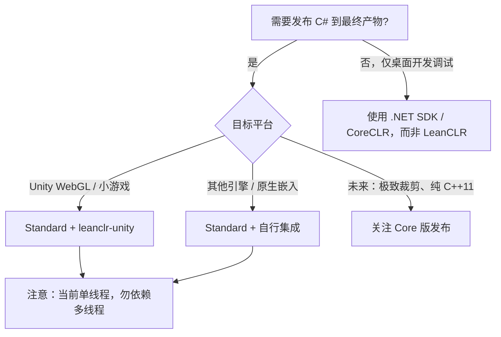

# Core 与 Standard 版本

## 版本总览

LeanCLR 规划提供 **Standard** 与 **Core** 两个版本。二者关系是：**Core 自 Standard 裁剪而来**，而非两条独立演进的产品线。

| 特性 | Standard（当前对外版本） | Core（规划中） |
|------|--------------------------|----------------|
| **现状** | ✅ 已对外可用 | 📋 规划中，尚未单独发布 |
| **线程模型** | 当前仅单线程；未来将支持完整多线程 | 单线程 |
| **平台相关 icalls** | 部分实现；跨平台相关仍在完善 | 不含平台相关代码，仅依赖 C++11 标准库 |
| **GC** | 准确式 mark-sweep 全量 GC | 主动式、精确式全量 GC（更精简） |
| **典型场景** | Unity WebGL / 小游戏发布、引擎集成 | 极致裁剪的纯脚本引擎、任意 C++11 平台 |

## Standard 版本

**当前你使用的就是 Standard 版**（尽管尚未开放多线程）。

特点与现状：

- **已可用于生产发布**，尤其在 Unity WebGL 与小游戏平台
- **当前为单线程**：多线程环境下可能出现问题，请勿在发布产物中依赖并发线程调用 LeanCLR API
- **跨平台 icalls 仍在完善**：部分平台相关能力尚不完整
- **面向未来**：将在 Standard 上逐步实现完整多线程、全平台支持，以及 Mono / Unity 与 CoreCLR .NET 8+ BCL 的兼容

## Core 版本

Core 版将从 Standard **裁剪**得到：

- 移除一切平台相关代码，**仅依赖纯 C++11**
- 保持单线程，追求最小体积与最佳移植性
- 适合作为嵌入任意支持 C++11 编译器平台的轻量脚本引擎

Core 版尚未单独发布；需要极致跨平台裁剪的用户可关注后续公告。

## 版本选型建议

- **Unity WebGL / 小游戏** → [leanclr-unity](../ecosystem/unity/) + Standard
- **原生 / WASM 嵌入** → 参考 [嵌入 LeanCLR](../integration/embed-leanclr)
- **桌面日常开发** → 不要用 LeanCLR；用系统 .NET 开发，仅在发布管线中切换到 LeanCLR
