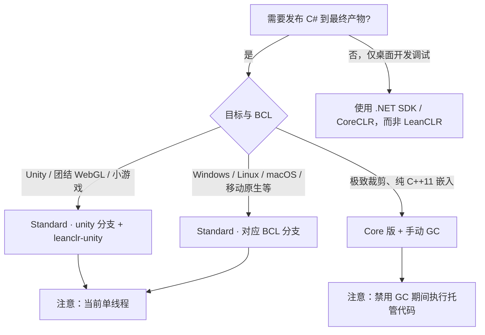

# Core 与 Standard 版本

## 版本总览

LeanCLR 提供 **Standard** 与 **Core** 两个版本。**Core 自 Standard 裁剪而来**，面向极致移植性；**Standard** 面向引擎集成与完整 BCL 场景。

| 特性 | Standard | Core |
|------|----------|------|
| **现状** | ✅ 已对外可用 | ✅ **已实现** |
| **线程模型** | 当前仅单线程（三 BCL 分支皆然） | 单线程 |
| **平台相关 icalls** | 大量尚未实现，持续完善 | 不含平台相关代码，仅 C++11 |
| **GC** | 准确式 Mark-Sweep，**自动**触发回收 | 准确式 Mark-Sweep，**须手动**管理（见下文） |
| **典型场景** | 全平台引擎集成、Unity / 原生发布 | 任意 C++11 平台嵌入、极致裁剪 |

## Standard 版本

**Unity 插件（leanclr-unity）与多数引擎集成使用的是 Standard 版。**

### BCL 分支

Standard 运行时按所链接的 BCL 基线分为三个**分支**（构建 / 集成时选定，非运行时切换）：

| 分支 | BCL 基线 | 现状 |
|------|----------|------|
| **mono** | Mono 类库生态 | ✅ **WebAssembly、小游戏平台**上已较稳定运行 |
| **unity** | Unity IL2CPP 裁剪 BCL | ✅ **WebAssembly、小游戏平台**上已较稳定运行（leanclr-unity 默认） |
| **coreclr** | CoreCLR / .NET 8+ 方向 | 🚧 **开发中**，尚未达到与 mono / unity 分支同等的生产可用度 |

三个分支**当前均仅支持单线程**，且**许多平台相关 icall 尚未实现**。选型时请按目标 BCL 与验证状态选择分支，不要假设 coreclr 分支已可用于生产。

### 平台支持（摘要）

Standard 版面向**跨平台发布**，在 **Windows、Linux、macOS、Android、iOS、鸿蒙（HarmonyOS / OpenHarmony）、WebAssembly** 等主流目标上均可构建与运行（具体以所选 BCL 分支与集成方式为准）。

按验证与常用场景可概括为：

| 类别 | 平台示例 | 说明 |
|------|----------|------|
| **桌面 / 服务器** | Windows、Linux、macOS | 原生嵌入与发布 |
| **移动** | Android、iOS、鸿蒙 | Standard 已支持；平台相关 icall 仍在补全 |
| **Web / 小游戏** | WebGL、微信 / 抖音等小游戏 | **mono、unity** 分支上已较稳定（Unity 见 [集成文档](../ecosystem/unity/)） |

- **多线程**：规划中；当前所有 BCL 分支均勿依赖并发调用 CLR API

### 使用注意

- 已可用于生产发布；**mono / unity** 分支在 WebGL、小游戏等场景验证较多，原生桌面与移动平台亦在持续完善 icall
- **当前为单线程**：请勿在发布产物中依赖多线程调用 LeanCLR API
- **跨平台 icalls 仍在完善**：部分 `System.*` 平台相关能力可能缺失或未实现

## Core 版本

Core 版已从 Standard **裁剪**并**已实现**，特点如下：

- **支持所有可编译 LeanCLR 的平台**（标准 C++11，无平台相关 icall 依赖）
- **单线程**
- **准确式 Mark-Sweep GC**，但回收策略与 Standard 不同：
  - GC **不会**在托管执行过程中自动介入，须由宿主**手动**触发
  - **执行托管代码前**应 **禁用 GC**（避免回收与托管栈/堆状态冲突）
  - **离开托管代码、返回原生侧后**由宿主**主动调用 GC**（如 `GC::collect()` / 等价 API）

典型嵌入流程示意：

```text
原生入口
  → GC::disable()          // 进入托管区前
  → 调用 LeanCLR 托管方法
  → GC::enable()           // 离开托管区后（若 API 要求成对恢复）
  → GC::collect()          // 主动全量回收（按帧/按关卡等策略）
原生继续
```

具体 API 以当前 `src/runtime/vm/gc.h` 及嵌入示例为准，见 [嵌入 LeanCLR](../integration/embed-leanclr#core-版-gc-手动管理)。

适合：需要**最小依赖、任意 C++11 平台**、自行掌控 GC 时机的轻量脚本引擎场景。

## 版本选型建议



| 场景 | 推荐 |
|------|------|
| Unity WebGL / 小游戏 | Standard **unity** + [leanclr-unity](../ecosystem/unity/) |
| Windows / Linux / macOS / Android / iOS / 鸿蒙等原生发布 | Standard（选用与工程匹配的 BCL 分支） |
| 原生 / WASM 嵌入、最小依赖 | **Core** + [嵌入 LeanCLR](../integration/embed-leanclr) |
| 桌面日常开发 | 不要用 LeanCLR；用系统 .NET，仅在发布管线切换 |

## 与文档其他章节的关系

- BCL 兼容性数据见 [兼容性说明](./compatibility)
- Unity 平台列表见 [支持与限制](../ecosystem/unity/requirements)
- 路线图见 [路线图](./roadmap)
